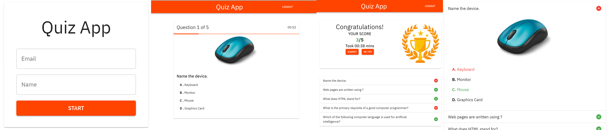

<a name="readme-top"></a>

<div align="center">
  
  <h1><b>Quiz - App</b></h1>
</div>
<div align="center">
  
</div>

# 📗 Table of Contents

- [📖 About the Project](#about-project)
  - [🛠 Built With](#built-with)
    - [Tech Stack](#tech-stack)
    <!-- - [Key Features](#key-features) -->
  <!-- - [🚀 Live Demo](#live-demo) -->
- [💻 Getting Started](#getting-started)
  - [Setup](#setup)
  - [Prerequisites](#prerequisites)
  - [Install](#install)
  - [Usage](#usage)
  <!-- - [Run tests](#run-tests) -->
  - [Deployment](#triangular_flag_on_post-deployment)
- [👥 Authors](#authors)
- [🤝 Contributing](#contributing)
- [⭐️ Show your support](#support)
- [🔭 Acknowledgements](#acknowledgements)
- [📝 License](#license)

<!-- PROJECT DESCRIPTION -->

# 🎯 Quiz App<a name="about-project"></a>

> Quiz App is a web application built using React, Context API for state managment, Asp.Net Core API, and Material UI. The Quiz App allows users to take quizzes on a variety of topics, with questions and answers being served from the Asp.Net Core API.

## 🛠 Built With <a name="built-with"></a>

### Tech Stack <a name="tech-stack"></a>

<details>
  <summary>Technology</summary>
  <ul>
    <li>React</li>
    <li>Context API</li>
    <li>Material UI</li>
    <li>Asp.Net Core API</li>
    <li>Entity Framework Core</li>
    <li>PostgreSQL hosted on ElephantSql/If interested for Microsoft® SQL Server® 2022 Express check feature branch</li>
  </ul>
</details>

<details>
  <summary>Tools</summary>
  <ul>
    <li>VS Code</li>
    <li>Visual Studio Community 2022</li>
    <li>Git</li>
  </ul>
</details>

<!-- Features -->

<!-- ### Key Features <a name="key-features"></a>

This project is a simple Quiz app. The main features are:

The app consists of three pages:

- **feature 1.** -->
<p align="right">(<a href="#readme-top">back to top</a>)</p>

<!-- LIVE DEMO -->

<!-- ## 🚀 Live Demo <a name="live-demo"></a>

- [Live Demo Link]()

<p align="right">(<a href="#readme-top">back to top</a>)</p> -->

<!-- GETTING STARTED -->

## 💻 Getting Started <a name="getting-started"></a>

To get a local copy up and running follow these simple example steps.

### Prerequisites

you have to those tools in your local machine.

- [ ] NPM
- [ ] GIT & GITHUB
- [ ] Any Code Editor (VS Code, Visual Studio 2022, Brackets, etc)

### Setup

Clone the project.

```bash
  git clone https://github.com/kifle23/quiz-app.git
```

Go to the project directory.

```bash
  cd quiz-app
```

In the project directory, you can run:

```bash
  npm start
```

Runs the app in the development mode.\
Open [http://localhost:3000](http://localhost:3000) to view it in your browser.

The page will reload when you make changes.

<p align="right">(<a href="#readme-top">back to top</a>)</p>
<!-- ### Run tests

```test
npx eslint "**/*.{js,jsx}"
npx stylelint "**/*.{css,scss}"
npm test
``` -->

```bash
  npm run build
```

Builds the app for production to the `build` folder.
The app will be ready for deployment!

<p align="right">(<a href="#readme-top">back to top</a>)</p>

<!-- AUTHORS -->

## 👥 Authors <a name="authors"></a>

### Author:

👤 **Kifle Haile**

- GitHub: [@githubhandle](https://github.com/kifle23)
- Twitter: [@twitterhandle](https://twitter.com/KifleHaile12)
- LinkedIn: [LinkedIn](https://www.linkedin.com/in/kifle-haile)
<p align="right">(<a href="#readme-top">back to top</a>)</p>

<!-- CONTRIBUTING -->

## 🤝 Contributing <a name="contributing"></a>

Contributions, issues, and feature requests are welcome!

Feel free to check the [issues page](https://github.com/kifle23/quiz-app/issues).

<p align="right">(<a href="#readme-top">back to top</a>)</p>

<!-- SUPPORT -->

## 👋 Show your support <a name="support"></a>

Give a ⭐️ if you like this project!

<p align="right">(<a href="#readme-top">back to top</a>)</p>

<!-- ACKNOWLEDGEMENTS -->

## 🔭Acknowledgments <a name="acknowledgements"></a>

- [Microverse](https://www.microverse.org/).
- [CodAffection](https://www.codaffection.com/)
- [ElephantSql](https://api.elephantsql.com/)

<p align="right">(<a href="#readme-top">back to top</a>)</p>

## 📝 License <a name="license"></a>

This project is [MIT](./LICENSE) licensed.

<p align="right">(<a href="#readme-top">back to top</a>)</p>
